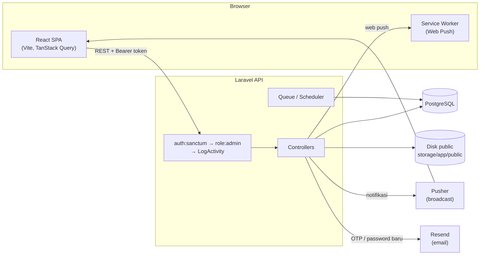
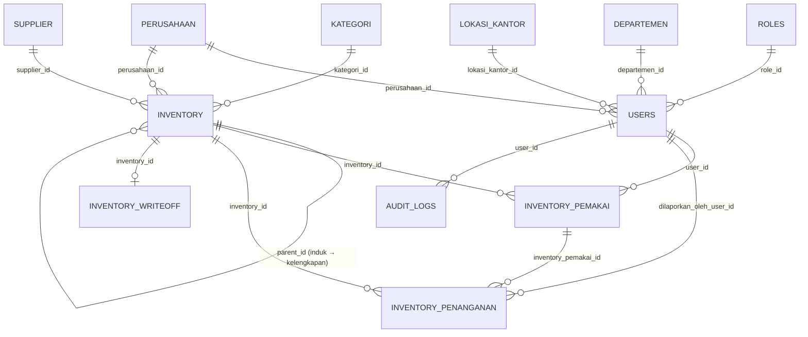
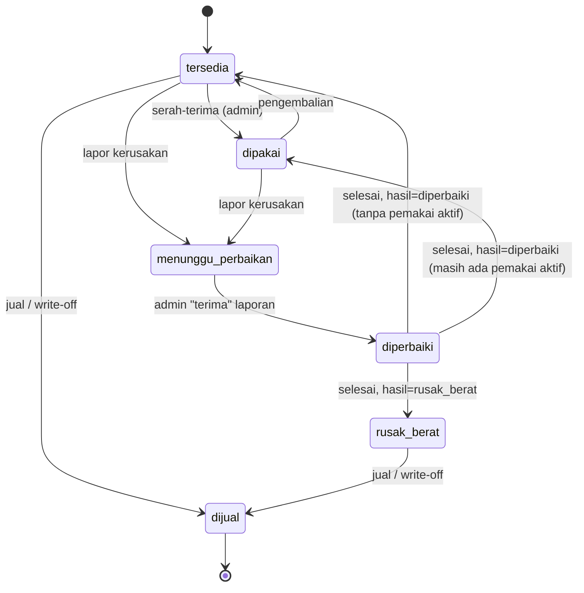

# Marimas IT Vault (Marimas ONE)

Aplikasi web internal untuk **mengelola inventory aset IT** perusahaan: dari pencatatan barang, serah-terima ke karyawan, pengembalian, laporan kerusakan dan perbaikan, sampai penghapusan/penjualan aset (write-off). Semua aksi penting terekam di audit log dan notifikasi dikirim secara real-time.

> Monorepo dengan dua aplikasi: **`apps/api`** (Laravel, REST API) dan **`apps/web`** (React, SPA).

---

## Daftar Isi

1. [Fitur Utama](#fitur-utama)
2. [Tech Stack](#tech-stack)
3. [Struktur Repo](#struktur-repo)
4. [Arsitektur](#arsitektur)
5. [Peran dan Hak Akses](#peran-dan-hak-akses)
6. [Model Data](#model-data)
7. [Logika Bisnis Inti](#logika-bisnis-inti)
8. [Referensi API](#referensi-api)
9. [Frontend](#frontend)
10. [Instalasi dan Menjalankan](#instalasi-dan-menjalankan)
11. [Variabel Environment](#variabel-environment)
12. [Deployment](#deployment)
13. [Perintah Artisan dan Scheduler](#perintah-artisan-dan-scheduler)
14. [Testing](#testing)
15. [Catatan Teknis dan Temuan](#catatan-teknis-dan-temuan)

---

## Fitur Utama

| Area | Kemampuan |
|---|---|
| **Inventory** | CRUD barang, kode otomatis `IT-YY-00001`, foto barang, kategori, supplier, perusahaan pemilik, garansi, nomor invoice/surat jalan/good receive |
| **Induk dan kelengkapan** | Satu barang bisa menjadi *induk* dan punya *kelengkapan* yang menempel (mis. laptop + charger + tas), maksimal 1 level |
| **Serah-terima** | Admin menyerahkan barang ke karyawan dengan 3 foto bukti, nomor struk `STJ-…`, dan kelengkapan ikut otomatis |
| **Pengembalian** | Admin atau pemakai sendiri mengembalikan barang dengan 3 foto bukti, nomor struk `KBL-…`, dan wajib mencocokkan struk serah-terima |
| **Penanganan kerusakan** | Siapa pun melapor kerusakan, lalu admin menerima, memperbaiki, dan menutup laporan dengan hasil *diperbaiki* atau *rusak berat* beserta biaya |
| **Write-off / jual** | Barang tersedia atau rusak berat dapat dijual/di-write-off dengan berita acara |
| **Master Data** | Inventory, Kategori, Data User (karyawan), Cabang (lokasi kantor), Perusahaan, Departemen, Supplier |
| **Import Excel** | Import massal inventory (format bukti serah-terima), karyawan, cabang, perusahaan, departemen, supplier, dan penanganan |
| **Laporan** | Export Excel/CSV, galeri foto inventory, dan riwayat aktivitas inventory |
| **Dashboard** | Dashboard terpisah untuk admin dan user: KPI, donut status, tren pembelian, top inventory, distribusi karyawan per departemen, kalender, timeline aktivitas |
| **Notifikasi** | Daftar notifikasi (database), real-time lewat Pusher/Laravel Echo, dan Web Push (service worker) |
| **Audit Log** | Setiap request yang mengubah data tercatat; retensi otomatis 7 hari aktif lalu 30 hari total |
| **Tema** | Mode terang/gelap |

---

## Tech Stack

**Backend (`apps/api`)**

- PHP `^8.3`, Laravel `^13.8`
- **PostgreSQL** (wajib, lihat [Catatan](#catatan-teknis-dan-temuan): migrasi memakai trigger PL/pgSQL)
- Laravel Sanctum (token Bearer), `maatwebsite/excel` (import), `laravel-notification-channels/webpush`, `pusher/pusher-php-server`, `resend/resend-laravel` (email), `predis/predis`
- Ekstensi PHP: `bcmath`, `gd`, `zip`
- Dev: PHPUnit 12, Laravel Pint, Pail

**Frontend (`apps/web`)**

- React 19, TypeScript, Vite 8, Tailwind CSS 4
- React Router 7, TanStack Query 5, Axios
- Recharts (grafik), ExcelJS (export Excel berformat), react-hot-toast, lucide-react, react-select
- Laravel Echo + pusher-js (real-time), Service Worker (`public/sw.js`) untuk Web Push

---

## Struktur Repo

```
Marimas-IT-Vault/
├── README.md
└── apps/
    ├── api/                              # Laravel
    │   ├── app/
    │   │   ├── Console/Commands/         # audit:cleanup, audit:purge, dll
    │   │   ├── Http/
    │   │   │   ├── Controllers/
    │   │   │   │   ├── Auth/             # login, register + OTP, profil, password
    │   │   │   │   ├── MasterData/       # Inventory, User, Cabang, Perusahaan, Departemen, Kategori, Supplier, Role
    │   │   │   │   ├── Transaksi/        # InventoryPemakai (serah-terima), InventoryPenanganan (kerusakan)
    │   │   │   │   ├── Concerns/         # GeneratesStrukNumber, SimpanFotoBukti
    │   │   │   │   ├── AuditLog/  Dashboard/  Notifikasi/  ImportController.php
    │   │   │   └── Middleware/           # EnsureUserIsMember (alias `role`), LogActivity
    │   │   ├── Imports/                  # Import Excel per entitas
    │   │   ├── Mail/  Notifications/  Models/
    │   ├── config/                       # absensi.php, webpush.php, cors.php, dll
    │   ├── database/migrations/          # skema (hasil squash)
    │   ├── database/seeders/             # DummySeeder (admin dev)
    │   ├── routes/                       # api.php, channels.php, console.php (scheduler)
    │   ├── tests/
    │   └── nixpacks.toml                 # build/start di Railway
    └── web/                              # React + Vite
        ├── public/                       # sw.js, logo, login-bg
        └── src/
            ├── api/                      # klien Axios per modul
            ├── components/               # layout, masterData, laporan, transaksi, shared
            ├── context/                  # AuthContext, ThemeContext
            ├── hooks/  lib/  utils/  types/
            └── pages/                    # auth, dashboard, masterData, laporan, transaksi, auditLog, settings
```

---

## Arsitektur



Poin penting:

- **Autentikasi:** token personal Sanctum (tanpa kedaluwarsa), disimpan di `localStorage` frontend dan dikirim sebagai `Authorization: Bearer …`. Respons 401 apa pun otomatis membersihkan token dan mengarahkan ke `/login`.
- **Otorisasi:** middleware `role:admin` untuk rute admin-only. Pembatasan *data* untuk non-admin dilakukan **di dalam controller** (bukan hanya di middleware).
- **Audit:** middleware `LogActivity` terpasang di seluruh grup `api`.
- **Upload file:** disimpan ke disk `public` (`storage/app/public`).

---

## Peran dan Hak Akses

Hanya ada **dua tingkat akses**, hasil penyederhanaan dari enam role lama (`guest`, `karyawan`, `manajer`, `hr`, `cabang`, `admin`). Role di-seed: `user` dan `admin`.

| Kemampuan | `admin` | `user` |
|---|:---:|:---:|
| Kelola Master Data (Kategori, Data User, Cabang, Perusahaan, Departemen, Supplier) | ✅ | ❌ |
| Tambah/ubah/hapus inventory, serah-terima, jual, pasang/lepas kelengkapan | ✅ | ❌ |
| Lihat inventory | Semua status | Hanya `tersedia` + yang sedang dia pegang/pending |
| Lapor kerusakan | ✅ | ✅ |
| Lihat laporan penanganan | Semua | Hanya yang terkait pemakaiannya |
| Kembalikan barang | Semua | Hanya barang yang dia pakai |
| Lihat riwayat inventory | Global | Hanya miliknya |
| Terima dan selesaikan penanganan | ✅ | ❌ |
| Halaman Laporan: Foto Inventory | ✅ | ❌ |
| Audit Log, Import Excel | ✅ | ❌ |
| Profil, ganti password, notifikasi, push | ✅ | ✅ |

Cara kerja middleware `EnsureUserIsMember` (alias `role`): jika daftar role di rute hanya berisi `admin`, rute itu admin-only. Jika ada role non-admin di daftar, semua pengguna login lolos.

---

## Model Data



| Tabel | Isi |
|---|---|
| `users` | Akun sekaligus data karyawan: `nik` (unik), `phone` (unik), `departemen_id`, `perusahaan_id`, `lokasi_kantor_id`, `tanggal_masuk`, `status` (`aktif`/`nonaktif`), `role_id` |
| `roles` | `user`, `admin` |
| `lokasi_kantor` | Disebut **Cabang** di UI (nama, alamat unik, telepon, link unik) |
| `perusahaan`, `departemen`, `supplier`, `kategori` | Data referensi. Kategori di-seed 13 nilai: Bag, Baterai, Case, Charger, Docking, Drawing Pad, Hdd External, Laptop, Modem, Pointer, Proyektor, Scanner Barcode, Speaker |
| `inventory` | Barang. `kode_inventory` unik, `parent_id` (self-FK), `serial_number` unik, `status`, `foto`, tanggal garansi/input/invoice, dll |
| `inventory_pemakai` | Riwayat serah-terima/pengembalian: struk, tanggal, **array foto (JSON)**, catatan, `status` (`pending`/`disetujui`/`ditolak`) |
| `inventory_penanganan` | Laporan kerusakan: jenis, keluhan, foto, tiga tahap waktu (lapor, diterima, selesai), `harga_jasa`, `biaya_komponen`, `hasil`, `no_struk` |
| `inventory_writeoff` | Catatan penjualan/write-off (satu per barang): alasan, berita acara, penyetuju |
| `audit_logs` | `user_id`, `method`, `endpoint`, `deskripsi`, `ip_address`, *soft delete* |
| lainnya | `notifications`, `push_subscriptions`, `personal_access_tokens`, `jobs`, `failed_jobs`, `cache`, `sessions` |

**Perilaku foreign key:** `inventory_pemakai`, `inventory_penanganan`, dan `inventory_writeoff` memakai `nullOnDelete`, jadi riwayat **tidak ikut terhapus** saat barang dihapus (kolom `inventory_id` menjadi `null`).

---

## Logika Bisnis Inti

### 1. Kode inventory otomatis

Trigger PL/pgSQL `trg_generate_kode_inventory` mengisi `kode_inventory` saat `INSERT` dengan format **`IT-{YY}-{nomor 5 digit}`**, contoh `IT-26-00027`. Nomor berikutnya diambil dari `MAX+1` per tahun, dengan `pg_advisory_xact_lock` agar aman dari balapan request. Frontend tidak boleh mengirim kode ini.

### 2. Induk dan kelengkapan

Struktur ditentukan **hanya oleh `parent_id`**, bukan oleh kategori (kategori hanya label bebas).

- Item induk/berdiri sendiri: `parent_id = null`.
- Item yang menempel: `parent_id` terisi.
- Aturan struktural (divalidasi di `InventoryController::validasiParent`):
  - tidak boleh menempel ke diri sendiri;
  - item yang sudah punya anak tidak boleh menempel ke induk lain;
  - target induk tidak boleh sudah menempel ke item lain (**maksimal 1 level**).
- **Invariant status** (`selaraskanStatusByParent`): item yang menempel otomatis berstatus `dipakai`; item yang dilepas/berdiri sendiri kembali `tersedia`.
- Endpoint khusus: `pasang-pengganti-kelengkapan` (pasang kelengkapan ke induk) dan `lepas-dari-induk` (lepas, disertai notifikasi).

### 3. Siklus status inventory



Status yang diterima form Inventory: `tersedia`, `dipakai`, `menunggu_perbaikan`, `diperbaiki`, `rusak_berat`. Status `dijual` hanya bisa dihasilkan lewat endpoint `jual`.

### 4. Serah-terima (`POST /api/inventory/{id}/pemakai`)

1. Hanya item **berdiri sendiri** dan berstatus **`tersedia`** yang bisa diserahkan. Kelengkapan yang menempel tidak bisa dipinjam sendirian.
2. Wajib **tepat 3 foto** (`jpg/jpeg/png/webp`, maksimal 1 MB per foto) dan `tanggal_penerimaan`.
3. Dibuat nomor struk **`STJ-YYYYMMDD-0001`** (urut per hari, dikunci dengan `lockForUpdate`).
4. Status barang menjadi `dipakai`.
5. **Kelengkapan ikut otomatis:** setiap anak yang belum punya pemakai aktif dan tidak sedang rusak/diperbaiki dibuatkan catatan pemakai sendiri (struk sendiri, foto dan tanggal yang sama) lalu menjadi `dipakai`.

### 5. Pengembalian (`POST /api/inventory-pemakai/{id}/kembalikan`)

- Boleh dilakukan **admin atau pemakai itu sendiri**.
- Wajib: `no_struk_penerimaan` (**harus sama persis** dengan struk serah-terima), `tanggal_pengembalian`, dan 3 foto bukti.
- **Ditolak** jika masih ada laporan penanganan yang belum selesai untuk pemakaian tersebut.
- Dibuat struk **`KBL-YYYYMMDD-0001`**. Barang kembali `tersedia`, **kecuali** berstatus `rusak_berat` (tetap tidak bisa dipinjam).
- Kelengkapan yang ikut aktif ditutup otomatis dengan foto/tanggal yang sama dan kembali `tersedia`.

### 6. Lapor kerusakan dan penanganan

```
Lapor (semua user)  →  Terima (admin)  →  Selesai (admin)
menunggu_perbaikan      diperbaiki          tersedia/dipakai  atau  rusak_berat
```

- **Lapor** (`POST /api/inventory-penanganan`): `jenis_kerusakan` ∈ `software | hardware | tidak_berfungsi | hancur | terputus_sobek`, `keluhan`, dan 1 foto (maks 1 MB). Ditolak jika barang sudah `rusak_berat`, sudah ada laporan aktif, atau sedang `menunggu_perbaikan/diperbaiki`. Pelapor dicatat di `dilaporkan_oleh_user_id`; `inventory_pemakai_id` terisi hanya jika pelapor memang pemakai aktif barang itu. Semua admin dinotifikasi.
- **Terima** (`…/{id}/terima`): mengisi waktu diterima dan mengubah status barang menjadi `diperbaiki`.
- **Selesai** (`POST …/{id}`): `hasil` = `diperbaiki` atau `rusak_berat`.
  - `diperbaiki` → `harga_jasa` dan `biaya_komponen` **wajib**; status kembali `dipakai` jika masih ada pemakai aktif, selain itu `tersedia`.
  - `rusak_berat` → biaya dipaksa `null` di server; status menjadi `rusak_berat` dan pemakaian aktif **ditutup otomatis**.
  - Nomor struk penanganan dibuat sekali, format **`YY-00001`** (urut per tahun).
  - Total biaya = jasa + komponen. Durasi pengerjaan dihitung dari waktu diterima sampai selesai.
  - Pelapor mendapat notifikasi saat pertama kali ditandai selesai.

### 7. Jual / write-off (`POST /api/inventory/{id}/jual`)

Hanya untuk item yang tidak punya anak, tidak menempel ke induk, dan berstatus `tersedia` atau `rusak_berat`. Status menjadi `dijual`, pemakaian aktif yang tersisa ditutup, dan dibuat `inventory_writeoff` (penyetuju, alasan, berita acara, tanggal).

### 8. Penghapusan dan guard integritas

- **Hapus inventory:** selalu ditolak jika masih ada pinjaman aktif (termasuk kelengkapan). Tanpa `force=1`, juga ditolak jika masih punya anak, masih menempel, atau punya riwayat peminjaman/perbaikan. Dengan `force=1`, anak dilepas menjadi `tersedia` (tidak ikut terhapus).
- **Hapus/nonaktifkan karyawan:** ditolak jika masih punya pinjaman `disetujui`/`pending` yang belum dikembalikan; pesan error menyebut kode inventory terkait.
- **Hapus cabang:** akun terhubung ikut dihapus dalam satu transaksi.

### 9. Audit log

- Mencatat `POST/PUT/PATCH/DELETE` (GET tidak dicatat). Dikecualikan: `login`, `logout`, `audit-log*`.
- Deskripsi dibuat manusiawi untuk aksi inventory, contoh *"Budi meminjamkan aset IT-26-00027 ke Sari"*, *"… melaporkan kerusakan aset: layar mati"*.
- **Retensi:** > 7 hari → soft delete ke "trash" (`audit:cleanup`, tiap jam); > 30 hari sejak dibuat → hapus permanen (`audit:purge`, harian).

### 10. Autentikasi

- **Login** dengan **email, nomor HP, atau nama** + password. Karena nama tidak unik, password dicek ke semua kandidat.
- **Registrasi mandiri** (`/register` → `/verify-otp`): data disimpan sementara di cache 5 menit dengan OTP 6 digit yang dikirim lewat email; akun dibuat dengan role `user` setelah OTP benar. Ada `resend-otp`.
- Ganti password lewat `/profile/password` atau `/change-password`; admin dapat menetapkan password pengguna lain lewat `/admin/users/{id}/set-password`.
- Import karyawan membuat akun dengan password default dari **nama depan** (huruf besar/kecil dipertahankan) dan mengirim notifikasi email `PasswordAkunBaru`.

### 11. Import Excel

| Endpoint | Entitas |
|---|---|
| `POST /api/inventory/import` | Inventory dari format *Bukti Serah Terima* atau hasil export |
| `POST /api/import-karyawan` | Karyawan |
| `POST /api/inventory-penanganan/import` | Penanganan |
| `POST /api/{cabang,perusahaan,departemen,supplier}/import` | Master data |

File `.xlsx`/`.xls`, maksimal 10 MB. Import inventory mendeteksi baris header otomatis (memindai maksimal 10 baris pertama), mendukung dua format (kolom `Nama Barang 1, 2, …` atau satu baris satu barang), mengisi kategori *"Belum Dikategorikan"* bila tidak diketahui, dan memetakan singkatan perusahaan (`MPK`, `UTH`). Pada format bertingkat, **kolom "Nama Barang 1" menjadi induk dan kolom berikutnya menjadi kelengkapannya**.

### 12. Notifikasi

| Notifikasi | Pemicu | Penerima |
|---|---|---|
| `AsetKerusakanDilaporkan` | Laporan kerusakan baru | Semua admin (pelapor hanya dapat entri database, tanpa alert real-time) |
| `AsetKerusakanSelesai` | Penanganan pertama kali selesai | Pelapor |
| `KelengkapanDilepasDariInduk` | Kelengkapan dilepas dari induk | Pihak terkait |
| `PasswordAkunBaru` | Akun dibuat lewat import | Karyawan baru (email, di-queue) |

Channel: `database`, `broadcast` (Pusher, channel privat `App.Models.User.{id}`), dan Web Push (VAPID). Kegagalan notifikasi **tidak** membatalkan transaksi utama (dibungkus try/catch dan dicatat ke log).

---

## Referensi API

Semua endpoint berprefiks `/api`. Kolom **Akses**: 🌐 publik, 🔑 user login, 🛡️ admin.

**Autentikasi dan profil**

| Method | Endpoint | Akses |
|---|---|:---:|
| POST | `/register`, `/verify-otp`, `/resend-otp`, `/login` | 🌐 |
| GET | `/roles` | 🌐 |
| GET | `/user` | 🔑 |
| POST | `/logout` | 🔑 |
| PUT | `/profile`, `/profile/password`, `/change-password` | 🔑 |
| POST | `/admin/users/{id}/set-password` | 🛡️ |

**Master data (semuanya 🛡️ kecuali dicatat)**

| Resource | Endpoint |
|---|---|
| Cabang | `apiResource /cabang` + `POST /cabang/import` |
| Perusahaan | `apiResource /perusahaan` + `POST /perusahaan/import` |
| Departemen | `apiResource /departemen` (tanpa show) + `POST /departemen/import` |
| Kategori | `apiResource /kategori` (tanpa show) |
| Supplier | `GET /supplier` (🔑), `POST/PUT/DELETE /supplier…` + `POST /supplier/import` (🛡️) |
| Karyawan | `GET/POST /karyawan`, `GET/PUT/DELETE /karyawan/{user}`, `POST /import-karyawan` |

**Inventory**

| Method | Endpoint | Akses | Keterangan |
|---|---|:---:|---|
| GET | `/inventory` | 🔑 | Filter `kategori_id`, `posisi=induk\|menempel`, `parent_id`. Non-admin otomatis dibatasi |
| GET | `/inventory/{id}` | 🔑 | Detail + riwayat |
| GET | `/inventory/foto` | 🛡️ | Foto dasar barang |
| POST | `/inventory` | 🛡️ | Buat |
| PUT | `/inventory/{id}` | 🛡️ | Update. Frontend mengirim `POST` + `_method=PUT` karena ada upload file |
| DELETE | `/inventory/{id}` | 🛡️ | Opsional `?force=1` |
| POST | `/inventory/{id}/pemakai` | 🛡️ | Serah-terima |
| POST | `/inventory/{id}/jual` | 🛡️ | Write-off |
| POST | `/inventory/{id}/pasang-pengganti-kelengkapan` | 🛡️ | Pasang ke induk |
| POST | `/inventory/{id}/lepas-dari-induk` | 🛡️ | Lepas dari induk |
| POST | `/inventory/import` | 🛡️ | Import Excel |

**Pemakaian dan penanganan**

| Method | Endpoint | Akses |
|---|---|:---:|
| GET | `/inventory-pemakai` · `/inventory-pemakai/foto` | 🛡️ |
| GET | `/inventory-pemakai/riwayat` | 🔑 (non-admin hanya miliknya) |
| POST | `/inventory-pemakai/{id}/kembalikan` | 🔑 (admin atau pemilik pemakaian) |
| DELETE | `/inventory-pemakai/{id}` | 🛡️ |
| GET | `/inventory-penanganan` | 🔑 (non-admin hanya miliknya) |
| POST | `/inventory-penanganan` | 🔑 (lapor kerusakan) |
| GET | `/inventory-penanganan/foto` | 🛡️ |
| POST | `/inventory-penanganan/{id}/terima` | 🛡️ |
| POST | `/inventory-penanganan/{id}` | 🛡️ (selesaikan/update) |
| DELETE | `/inventory-penanganan/{id}` | 🛡️ |
| POST | `/inventory-penanganan/import` | 🛡️ |

**Lainnya**

| Method | Endpoint | Akses |
|---|---|:---:|
| GET | `/dashboard/kpd` (karyawan per departemen) | 🔑 |
| GET | `/audit-log`, `/audit-log/trash` | 🛡️ |
| GET/POST/DELETE | `/notifications`, `/notifications/{id}/read`, `/notifications/read-all`, `/notifications/{id}` | 🔑 |
| POST/DELETE | `/push-subscriptions` | 🔑 |
| POST | `/broadcasting/auth` | 🔑 |
| GET | `/up` (health check, di luar `/api`) | 🌐 |

> **Urutan rute penting:** `/…/import` dan `/inventory/foto` didaftarkan **sebelum** `apiResource`/`/inventory/{inventory}` supaya tidak tertangkap sebagai parameter. Jangan ubah urutannya.

---

## Frontend

**Rute utama**

| Path | Halaman |
|---|---|
| `/login`, `/verify-otp` | Autentikasi |
| `/dashboard` | Dashboard (admin/user berbeda) |
| `/master-data?tab=…` | Tab: `inventory`, `kategori`, `karyawan`, `cabang`, `perusahaan`, `departemen`, `supplier` |
| `/penanganan-inventory` | Daftar dan alur penanganan kerusakan |
| `/laporan?tab=…` | `export_data`, `foto_inventory` (admin), `riwayat_inventory`. Seluruh `/laporan` dibungkus `AdminRoute` |
| `/karyawan/create`, `/karyawan/:id`, `/karyawan/:id/edit` | Form/detail karyawan (admin), dibuka sebagai overlay di atas halaman sebelumnya |
| `/audit-log`, `/settings` | Audit log dan pengaturan profil/password/push |

Rute lama (`/inventory`, `/inventaris`, `/karyawan`, `/cabang`, `/dashboard-analytics`) dialihkan ke lokasi barunya.

**Pola penting**

- `AppLayout` memuat sidebar dan menyaring menu berdasarkan role; `AdminRoute` mengarahkan non-admin kembali ke dashboard.
- Data diambil dengan TanStack Query; `AuthContext` memvalidasi token ke `/user` setiap aplikasi dibuka dan membersihkan cache saat berganti akun.
- Modal alur inventory: form, serah-terima, pengembalian, lapor kerusakan, pasang ke induk, lepas dari induk, konfirmasi jual.
- Cetak struk lewat jendela cetak (`utils/printStruk.ts`); export Excel berformat lewat ExcelJS (`utils/excelReport.ts`).

---

## Instalasi dan Menjalankan

### Prasyarat

PHP 8.3 (+ `bcmath`, `gd`, `zip`), Composer, Node.js (disarankan LTS terbaru), dan **PostgreSQL**.

### Backend

```bash
cd apps/api
composer install

# Buat file .env (lihat bagian "Variabel Environment"; .env.example belum ada di repo)
php artisan key:generate

# Pastikan DB_CONNECTION=pgsql dan database sudah dibuat
php artisan migrate

# (khusus development) buat akun admin dummy
php artisan db:seed --class=DummySeeder
#   email: test@example.com   password: dummyPassword
#   WAJIB dihapus/diganti di produksi

php artisan storage:link        # supaya foto bisa diakses lewat /storage
php artisan serve               # http://localhost:8000
```

Proses pendukung (jalankan di terminal terpisah):

```bash
php artisan queue:listen --tries=1 --timeout=0   # email/notifikasi yang di-queue
php artisan schedule:work                        # menjalankan audit:cleanup & audit:purge
```

Atau semuanya sekaligus: `composer dev` (server, queue, pail, vite).

### Frontend

```bash
cd apps/web
cp .env.example .env     # isi VITE_API_URL, dll
npm install
npm run dev              # http://localhost:5173
npm run build            # tsc -b && vite build
npm run lint
```

Jika dev server sudah berjalan saat mengubah `.env`, hentikan lalu jalankan ulang agar variabel `VITE_*` terbaca.

---

## Variabel Environment

### Backend (`apps/api/.env`)

| Variabel | Fungsi |
|---|---|
| `APP_KEY`, `APP_URL`, `APP_ENV`, `APP_DEBUG` | Dasar aplikasi |
| `FRONTEND_URL` | Ditambahkan ke daftar origin CORS |
| `DB_CONNECTION=pgsql`, `DB_URL` **atau** `DB_HOST/PORT/DATABASE/USERNAME/PASSWORD` | Database (default bawaan Laravel adalah sqlite, **harus diganti**) |
| `MAIL_MAILER=resend`, `RESEND_API_KEY`, `MAIL_FROM_ADDRESS`, `MAIL_FROM_NAME` | Email OTP dan password baru (default `log`) |
| `BROADCAST_CONNECTION=pusher`, `PUSHER_APP_ID/KEY/SECRET/CLUSTER` | Notifikasi real-time (default `null`) |
| `VAPID_PUBLIC_KEY`, `VAPID_PRIVATE_KEY` (+ subject) | Web Push |
| `QUEUE_CONNECTION`, `CACHE_STORE` | Default `database`; OTP registrasi disimpan di cache |
| `FILESYSTEM_DISK`, `LOG_LEVEL`, `LOG_CHANNEL` | Storage dan log |
| `OFFICE_LATITUDE`, `OFFICE_LONGITUDE`, `OFFICE_RADIUS_METERS` | Dibaca `config/absensi.php` (sisa modul absensi, tidak dipakai kode saat ini) |

### Frontend (`apps/web/.env`)

| Variabel | Fungsi |
|---|---|
| `VITE_API_URL` | Base URL backend tanpa `/api` (default `http://localhost:8000`) |
| `VITE_PUSHER_KEY`, `VITE_PUSHER_CLUSTER`, `VITE_PUSHER_HOST`, `VITE_PUSHER_PORT` | Laravel Echo. Tanpa `VITE_PUSHER_KEY`, real-time dimatikan |
| `VITE_VAPID_PUBLIC_KEY` | Langganan Web Push |

Nilai `PUSHER_APP_KEY` backend harus cocok dengan `VITE_PUSHER_KEY` frontend.

---

## Deployment

Konfigurasi di repo menunjukkan penyebaran seperti ini:

- **Backend:** Railway dengan Nixpacks (`apps/api/nixpacks.toml`): PHP 8.3 + `bcmath`, `gd`, `zip`. Perintah start: `config:clear`, `route:clear`, `view:clear`, `migrate --force`, lalu `php artisan serve --host=0.0.0.0 --port=$PORT`.
- **Frontend:** Vercel/Railway (origin CORS `marimas-one-front*.vercel.app`, `marimas-one-front*.up.railway.app`, dan `marimas-one.my.id`).
- **Penyimpanan file:** disk `public` **harus di-mount ke persistent volume** agar foto bukti tidak hilang saat redeploy. Karena disk lokal, backend sebaiknya berjalan **1 replika**.

Hal yang **tidak** ditangani start command bawaan dan perlu service/proses terpisah:

1. `php artisan storage:link`
2. Queue worker (`queue:work`), untuk email dan notifikasi yang di-queue
3. Scheduler (`schedule:work` atau cron `schedule:run` tiap menit), karena retensi audit log bergantung padanya

---

## Perintah Artisan dan Scheduler

| Perintah | Fungsi | Jadwal |
|---|---|---|
| `audit:cleanup` | Soft-delete audit log > 7 hari | Tiap jam |
| `audit:purge` | Hapus permanen audit log di trash yang umurnya > 30 hari | Harian |
| `app:fix-orphaned-aset-pemakai [--dry-run]` | Tutup paksa catatan pemakaian aktif yang itemnya sudah bukan `dipakai` (perbaikan data lama) | Manual |
| `audit:verify-scenario` | Skenario uji retensi sementara (membuat lalu membersihkan data dummy) | Manual, hanya dev |
| `aset:backfill-tanggal-pembelian` | Backfill lama | Lihat [Catatan](#catatan-teknis-dan-temuan) |

---

## Testing

```bash
cd apps/api
composer test        # php artisan config:clear && php artisan test
```

Saat ini yang diuji hanya **retensi audit log** (`AuditCleanupTest`, `AuditPurgeTest`) plus contoh bawaan Laravel. Alur inti (serah-terima, pengembalian, penanganan, scoping per role) **belum punya test otomatis**.

Frontend: `npm run lint` dan `npm run build` (type-check `tsc -b`).

---

## Catatan Teknis dan Temuan

Hasil penelusuran kode yang perlu diketahui sebelum produksi atau pengembangan lanjutan:

**Perlu diperbaiki**

1. **Akun `nonaktif` masih bisa login.** Kolom `users.status` hanya dicek saat menghapus/menonaktifkan (guard pinjaman), tetapi `AuthController::login` maupun middleware tidak memeriksanya.
2. **Migrasi tanpa ekstensi:** `database/migrations/2026_09_23_000000_remove_cabang_role` tidak berakhiran `.php`, sehingga **tidak pernah dijalankan** Laravel. (Pada instalasi baru role `cabang` memang tidak pernah dibuat, jadi dampaknya hanya pada database lama.)
3. **Rute tanpa method:** `POST /cabang/{cabang}/resend-email` mengarah ke `CabangController::resendEmail`, tetapi method itu tidak ada.
4. **Frontend mengarah ke `/register`**, padahal rute tersebut tidak ada di `App.tsx`; endpoint registrasi/OTP backend sudah siap tetapi UI pendaftarannya belum tersambung (halaman login tidak punya tautan daftar).
5. **`.env.example` backend tidak ada** (skrip `composer setup` mengandalkannya).
6. **Komentar tidak sinkron:** `AsetKerusakanDilaporkan::via()` berkomentar bahwa Web Push dimatikan sementara, padahal `WebPushChannel::class` masih dikembalikan. Tanpa VAPID key, channel ini bisa melempar error.
7. **Skema vs kode lama:** `aset:backfill-tanggal-pembelian` memakai kolom `tanggal_pembelian` yang tidak ada di migrasi; `Inventory::$fillable` memuat beberapa kolom (`tanggal`, `nik`, `penerima`, `diterima_oleh`, `diketahui`, `dibuat_oleh`, `diketahui_hrd`, `tanggal_rusak`) yang tidak dibuat oleh migrasi saat ini.
8. **`apps/api/AGENTS.md`** berisi aturan untuk Next.js, tidak relevan dengan proyek Laravel ini.

**Sisa/legacy (aman dibersihkan bila tidak dipakai)**

- Status pemakaian `pending`/`ditolak` dan kolom `requested_by_user_id` ada di skema, tetapi tidak ada endpoint persetujuan; serah-terima langsung berstatus `disetujui`.
- Konsep role/akun `cabang` sudah dihapus dari alur, tetapi sisanya masih ada (`LokasiKantor::akunCabang()`, `BranchCredentials`, `NewPasswordMail`).
- Konfigurasi `GEMINI_API_KEY`, `FONNTE_TOKEN`, `ABLY_KEY`, dan `config/absensi.php` tidak dipakai kode aplikasi.
- Dependensi frontend yang tidak diimpor di `src/`: `face-api.js`, `html5-qrcode`, `jsqr`, `qrcode.react`, `react-webcam`, `pdfjs-dist`, `papaparse`, `xlsx`.
- Skrip sekali pakai: `apps/api/refactor-be-fase4.mjs`, `apps/web/cleanup-dead-code.mjs`; halaman `welcome.blade.php` bawaan Laravel (72 KB); `logo.png` duplikat di `apps/web/` dan `apps/web/public/`.
- File README bawaan (`apps/api/README.md`, `apps/web/README.md`) masih template Laravel/Vite; `apps/web/README-echo.md` berisi panduan setup Echo/Pusher.

**Keamanan**

- Jangan memakai `DummySeeder` (`test@example.com` / `dummyPassword`) di produksi.
- Password default hasil import adalah nama depan karyawan; sarankan ganti password saat login pertama.
- Daftar origin CORS (`config/cors.php`) berisi domain produksi dan alamat jaringan internal yang di-hardcode; sesuaikan dengan lingkungan Anda.
- Token Sanctum tidak punya masa kedaluwarsa (`expiration => null`).
- Jika file `app.zip` (±51 MB) di riwayat git pernah berisi kredensial, anggap kredensial itu bocor dan ganti.

**Konvensi kode**

- Penamaan domain memakai Bahasa Indonesia (`inventory_pemakai`, `penanganan`, `kembalikan`, `jual`); komentar kode juga banyak berisi riwayat refactor ("Fase 2", "squash") yang berguna untuk memahami alasan desain.
- Migrasi sudah di-*squash* ke bentuk akhir (tanggal `2026_01_01_…`) ditambah beberapa migrasi revisi September 2026; instalasi baru langsung memperoleh skema final.
